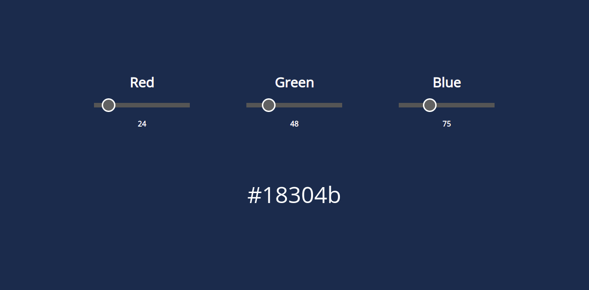

<h1 align="center">RGB to Hex Converter</h1>

A simple tool to convert RGB colors to hexadecimal

## About

This is a tool to convert RGB colors to hexadecimal built with pure JavaScript. Combine colors and see the result in real time, then have the hexadecimal on hand to use in your projects.

## Contribute

Open an **issue** or **pull request** for this project

## License

[MIT License]()
